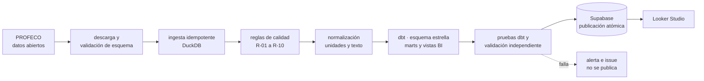

# Canasta de precios PROFECO · pipeline reproducible

Pipeline de datos que toma los archivos abiertos de **Quién es Quién en los Precios** (PROFECO), normaliza
productos y presentaciones, modela un esquema estrella, calcula el costo semanal de una canasta de 16 alimentos y
publica tablas analíticas listas para un dashboard.

De 36 millones de precios crudos a cuatro marts que responden cinco preguntas, con pruebas en cada paso y una
ejecución semanal automatizada.

**Stack:** Python 3.12 · DuckDB · dbt · PostgreSQL (Supabase) · GitHub Actions · Looker Studio · pytest · ruff

## Preguntas que responde

1. ¿Cuánto cuesta la misma canasta en diferentes cadenas y municipios?
2. ¿Cuánto puede ahorrar una familia al elegir la cadena más económica?
3. ¿Cómo cambia el costo de la canasta semana a semana?
4. ¿Qué productos explican las mayores diferencias de precio?
5. ¿Qué tan completa y representativa es la información utilizada?

Las respuestas, con sus salvedades, están en [`reports/memo_ejecutivo.md`](reports/memo_ejecutivo.md) (versión
ejecutiva) y [`reports/resultados_canasta.md`](reports/resultados_canasta.md) (versión con todas las tablas).

## Arquitectura



Detalle en [`docs/arquitectura.md`](docs/arquitectura.md): componentes, modelo dimensional, modos de ejecución,
compuertas de calidad, publicación y seguridad.

## Cómo ejecutarlo

Requisitos: Python 3.11 a 3.13 y, para leer los RAR de PROFECO, una de estas herramientas: `bsdtar`
(`libarchive-tools`), `unrar` o 7-Zip.

```bash
python -m venv .venv && . .venv/bin/activate   # Windows: .venv\Scripts\activate
pip install -r requirements.txt
```

**Sin descargar nada** (muestra versionada de 5 archivos, termina en menos de un minuto):

```bash
python -m src.cli --muestra pipeline
```

**Con los datos completos** (~377 MB, unos 10 minutos):

```bash
python -m src.cli download     # o coloca los archivos a mano en data/raw/
python -m src.cli pipeline
```

`make pipeline` y `make pipeline MUESTRA=1` hacen lo mismo donde hay `make`. Cada paso se puede ejecutar por
separado: `inspect`, `ingest`, `quality`, `normalize`, `dbt-run`, `dbt-test`, `quality-marts`, `validate`,
`resultados`, `publish`, `alertas`. `pipeline --desde <paso>` reanuda desde un paso.

Sin credenciales de Supabase configuradas, el pipeline termina correctamente después de validar los marts y avisa
que no publicará.

### Publicación (opcional)

Copia `.env.example` a `.env` y completa las variables `SUPABASE_DB_*`. En GitHub Actions los mismos nombres son
secretos del repositorio. La guía de conexión, el rol de solo lectura y la especificación del dashboard están en
[`docs/dashboard_looker_studio.md`](docs/dashboard_looker_studio.md).

### Pruebas

```bash
pytest -q          # 83 pruebas, incluidas las de integración contra PostgreSQL real
ruff check .
python -m src.cli --muestra pipeline
```

Las pruebas de integración del publicador usan el PostgreSQL de `QQP_TEST_PG_DSN` o uno embebido
(`pip install -e ".[pg-local]"`); si no hay ninguno, se omiten.

## Qué hay en el repositorio

```text
src/           ingesta, calidad, normalización, análisis y publicación
transform/     proyecto dbt: staging → intermediate → core → marts → bi
tests/         pruebas unitarias y de integración
docs/          arquitectura, decisiones, contratos, reglas, limitaciones, bitácora
reports/       perfil de datos, calidad, resultados, memo ejecutivo
data/          raw (inmutable), sample (versionada), mappings, processed (ignorado)
.github/       ejecución semanal y pruebas en cada push
```

## Documentación

| Documento | Para qué |
|---|---|
| [`docs/arquitectura.md`](docs/arquitectura.md) | Cómo funciona el pipeline de punta a punta |
| [`docs/decisiones.md`](docs/decisiones.md) | Registro de decisiones (D-001 a D-039) con contexto y consecuencias |
| [`docs/contrato_datos.md`](docs/contrato_datos.md) | Contrato de cada tabla: grano, llaves, tipos, nulos, supuestos |
| [`docs/catalogo_metricas.md`](docs/catalogo_metricas.md) | Definición y fórmula de cada métrica, con su trazabilidad |
| [`docs/reglas_calidad.md`](docs/reglas_calidad.md) | Reglas, umbrales y qué pasa cuando fallan |
| [`docs/diccionario_validado.md`](docs/diccionario_validado.md) | Esquema real de los CSV, contrastado con el diccionario oficial |
| [`docs/normalizacion.md`](docs/normalizacion.md) | Llaves canónicas, caracteres perdidos y unidades base |
| [`docs/limitaciones.md`](docs/limitaciones.md) | Supuestos y limitaciones (L-01 a L-23) |
| [`docs/dashboard_looker_studio.md`](docs/dashboard_looker_studio.md) | Conexión, fuentes, páginas y campos calculados |
| [`docs/caso_estudio.md`](docs/caso_estudio.md) | Cómo se construyó: problemas reales y decisiones de ingeniería |
| [`docs/bitacora.md`](docs/bitacora.md) | Bitácora por fase, con evidencia de pruebas |

## Automatización

El workflow [`pipeline-semanal.yml`](.github/workflows/pipeline-semanal.yml) tiene dos trabajos:

- **Pruebas** en cada push y pull request: lint, pruebas unitarias y de integración (servicio PostgreSQL 16) y el
  pipeline completo con la muestra, incluida una publicación de prueba.
- **Pipeline completo** los lunes a las 13:00 UTC y a demanda: descarga los archivos vigentes, ejecuta cada paso por
  separado y publica en Supabase solo si todo pasó. Ante cualquier falla escribe un resumen, opcionalmente notifica
  a un webhook y abre o actualiza un issue de alerta.

## Alcance y límites

- Los precios provienen de ciudades muestreadas por PROFECO (una por estado en la mayoría de los casos), no de la
  entidad completa.
- La canasta v1 es **genérica**: cada artículo es la mediana del precio unitario de cualquier marca comparable, así
  que parte de la diferencia entre cadenas refleja su mezcla de marcas (marca propia frente a marca comercial).
- El costo de la canasta es un **índice comparable** entre cadenas y semanas, no el gasto real de un hogar.
- Las comparaciones entre cadenas siempre son pareadas: misma canasta, mismo municipio y misma semana.

La lista completa está en [`docs/limitaciones.md`](docs/limitaciones.md).

## Licencia y datos

Los datos son de PROFECO, publicados en [datos abiertos](https://datos.profeco.gob.mx/datos_abiertos/qqp.php);
este repositorio no los redistribuye: solo versiona una muestra pequeña para pruebas.
