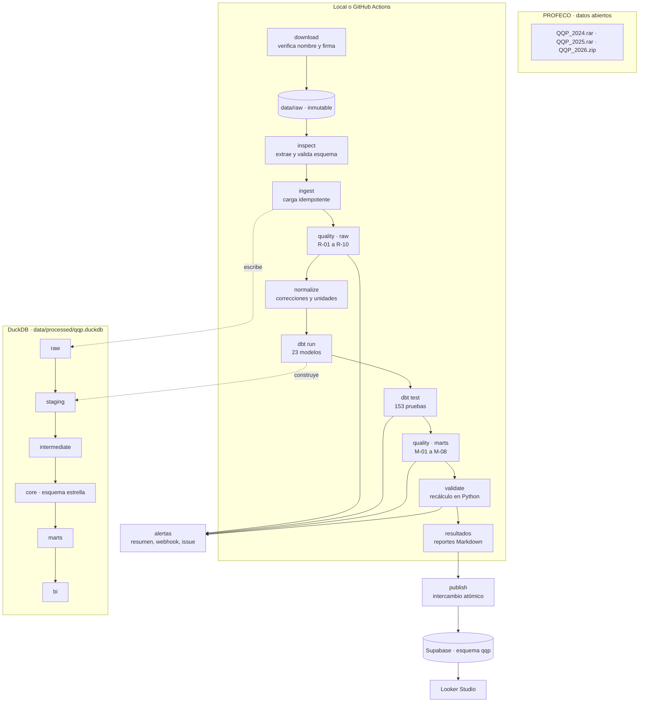
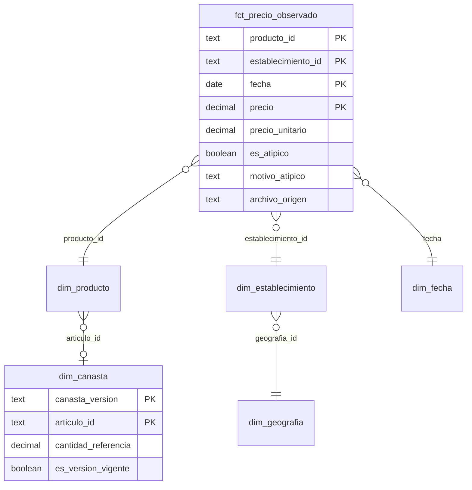
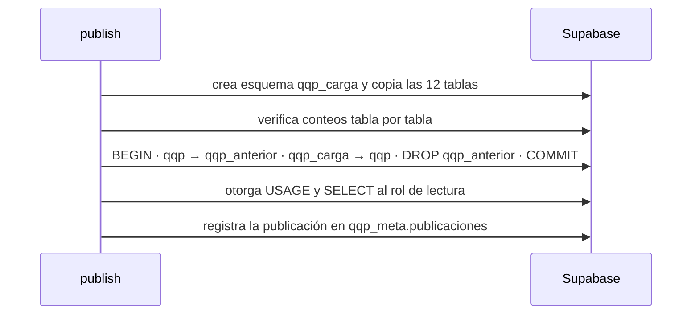

# Arquitectura

Pipeline de precios de **Quién es Quién en los Precios** (PROFECO) que responde cinco preguntas de negocio
(`README.md`) a partir de los CSV quincenales publicados como datos abiertos.

Principios que explican casi todas las decisiones (`docs/decisiones.md`):

1. **Nada se asume del origen.** Formato, codificación, fecha y esquema se detectan por archivo y se validan antes
   de cargar. Un cambio inesperado detiene el pipeline en lugar de producir cifras silenciosamente incorrectas.
2. **El dato original se conserva.** La capa cruda es copia fiel; las correcciones y las banderas viven en capas
   superiores, con el valor original al lado.
3. **Todo es reproducible y determinista.** Mismos archivos → mismos resultados, incluidos los atípicos y las
   medianas (D-021).
4. **Publicar solo lo verificado.** La publicación ocurre al final y solo si todas las pruebas y validaciones pasan.

## 1. Flujo

Un fallo en cualquier paso detiene la ejecución con código distinto de cero, dispara la alerta y **no publica**: la
versión anterior en Supabase sigue vigente.

## 2. Componentes

| Capa | Dónde | Qué hace |
|---|---|---|
| Descarga | `src/ingest/download.py` | Enlaces versionados en `data/fuentes_profeco.csv`; verifica el nombre declarado por el servidor y la firma ZIP/RAR antes de tocar `data/raw`. No sobrescribe un original salvo con `--reemplazar` (D-032). |
| Inspección | `src/ingest/extract.py`, `sniff.py`, `csv_source.py` | Extrae verificando CRC32 y tamaño; detecta BOM, codificación, delimitador, fin de línea y formato de fecha leyendo por bloques; valida el encabezado (15 columnas esenciales + adicionales revisadas, D-037). |
| Ingesta | `src/ingest/load.py` | Un archivo = ruta relativa + CRC32. Mismo CRC32 → se omite; contenido distinto → se reemplazan sus filas en una transacción. Verifica filas insertadas = líneas físicas − 1. |
| Calidad | `src/quality/checks.py` | 10 reglas sobre la capa cruda y 8 sobre el modelo, con umbral y severidad (`docs/reglas_calidad.md`). |
| Normalización | `src/normalize/` | Llave canónica (mayúsculas, sin acentos), corrección de caracteres perdidos por candidato único (D-038) e interpretación de presentaciones a unidad base (kg, l, pieza). Decisiones manuales versionadas aparte. |
| Modelado | `transform/` (dbt-duckdb) | staging → intermediate → core (estrella) → marts → bi. |
| Análisis | `src/analysis/` | Selección de la canasta, recálculo independiente (compuerta) y reportes de resultados. |
| Publicación | `src/publish/postgres.py` | Carga a un esquema temporal, verifica conteos y reemplaza el esquema en una sola transacción (D-029). |
| Automatización | `.github/workflows/pipeline-semanal.yml` | Pruebas en cada push y PR; pipeline completo los lunes y a demanda. |
| Alertas | `src/alertas.py` | Resumen en `$GITHUB_STEP_SUMMARY`, webhook opcional e issue automático ante falla. |

## 3. Modelo dimensional

Grano de la tabla de hechos: **una observación de precio de un producto normalizado, en un establecimiento, en una
fecha**. Filas idénticas y la misma observación publicada en varios catálogos se cuentan una vez; la pertenencia a
catálogos se guarda como máscara de bits (D-006, D-017).

Sobre los hechos se construyen los cuatro marts que responden las preguntas de negocio y seis tablas `bi`
precalculadas para el dashboard (`docs/catalogo_metricas.md`). El contrato completo de cada tabla, con llaves,
nulos y supuestos, está en `docs/contrato_datos.md`.

## 4. Modos de ejecución

| Modo | Datos | Base | Salidas | Para qué |
|---|---|---|---|---|
| `completo` | `data/raw` (~377 MB, 62 archivos) | `data/processed/qqp.duckdb` | `data/mappings/`, `reports/` (versionados) | Ejecución real, semanal en CI |
| `--muestra` | `data/sample/csv` (5 archivos versionados) | `qqp_muestra.duckdb` | `data/processed/muestra/` (ignorado) | Pruebas y CI en segundos, sin descargar nada |

La muestra es determinista: filas de los productos de canasta en dos municipios, más un 3% del resto y un 10% de
las filas con caracteres perdidos, seleccionadas por hash (`src/ingest/sample.py`).

## 5. Rendimiento y límites

- DuckDB con **4 hilos y 8 GB** por defecto (`QQP_DUCKDB_THREADS`, `QQP_DUCKDB_MEMORY_LIMIT`): el equipo de
  desarrollo se apagaba por protección térmica con consultas de muchos hilos sostenidas (D-004, L-15).
- Las consultas pesadas se hacen **archivo por archivo** y se agrupan por enteros locales en lugar de textos largos
  (D-005).
- dbt se ejecuta como **subproceso** para liberar la conexión y la memoria al terminar, con `PYTHONUTF8=1` (D-035).
- Referencia en GitHub Actions (4 vCPU, 16 GB) con 62 archivos y 36 M de filas: descarga 12 s, inspección 80 s,
  ingesta 125 s, `dbt run` 163 s, `dbt test` 10 s, validación 7 s, publicación 12 s.

## 6. Compuertas de calidad

1. **Ingesta**: esquema, formato de fecha y conteo de filas por archivo; si falla, se revierte solo ese archivo.
2. **Reglas con umbral**: `error` detiene, `advertencia` se reporta (por ejemplo M-08, datos más viejos de 35 días).
3. **Pruebas dbt**: unicidad, integridad referencial, validez, coherencia y conservación de registros.
4. **Validación independiente**: `src/analysis/validacion.py` recalcula en Python, desde la capa cruda, el costo de
   canasta y el ahorro de una muestra determinista de municipio-semanas y los compara con los marts (±0.011 MXN).
   Es la compuerta final antes de publicar.

## 7. Publicación

El intercambio ocurre en una sola transacción: el dashboard nunca ve una versión a medias y un fallo a mitad de la
carga conserva la anterior (probado contra PostgreSQL 16 real). Para caber en el plan gratuito de Supabase
(500 MB) se publica una versión compacta: agregados nacionales de disponibilidad y detalle precio-producto limitado
a 52 semanas (D-036).

## 8. Seguridad

- Sin credenciales en el repositorio: solo nombres de variables en `.env.example`; en CI, secretos de GitHub.
- La conexión usa el *pooler* en modo sesión de Supabase (IPv4); la conexión directa es IPv6 y no es alcanzable
  desde GitHub Actions (D-031).
- El publicador valida la configuración antes de conectar y sus mensajes de error nunca incluyen valores de
  secretos.
- El dashboard se conecta con un rol de solo lectura (`looker_lector`) que recibe `USAGE` y `SELECT` en cada
  publicación; los roles públicos de Supabase no tienen acceso al esquema.
- `data/raw` y las bases locales están en `.gitignore`.
