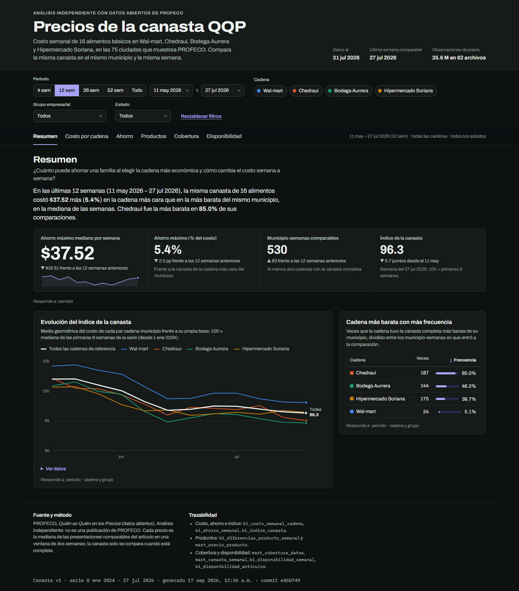

# Dashboard de la canasta

Dashboard estático que responde las cinco preguntas de negocio con las mismas tablas que se publican en Supabase.
Es un solo archivo HTML generado por el pipeline: no necesita servidor, credenciales ni librerías externas (D-040).
La especificación equivalente para Looker Studio está en `docs/dashboard_looker_studio.md`; ambas leen las mismas
tablas y usan las mismas agregaciones.



## 1. Generar y abrir

```bash
python -m src.cli dashboard            # o: make dashboard
python -m src.cli --muestra dashboard  # con la muestra versionada
```

Requiere la base DuckDB construida (`pipeline` o, al menos, hasta `dbt-run`). Escribe
`reports/dashboard/index.html` (con `--muestra`, en `data/processed/muestra/reports/dashboard/`). El archivo no se
versiona: se regenera en cada ejecución y el workflow semanal lo guarda como artefacto.

Se abre con doble clic. Las fuentes vienen de Google Fonts; sin conexión, el navegador usa las fuentes del sistema.
Para servirlo en local:

```bash
python -m http.server 8765 --directory reports/dashboard
```

`python -m src.dashboard.generar --fragmento RUTA` escribe además una versión sin `<html>`, `<head>` ni `<body>` para
incrustarla en un anfitrión que ya aporta el esqueleto del documento.

## 2. Páginas

Cada página abre con la pregunta que responde y una lectura en una frase, calculada con los filtros vigentes. Cada
tarjeta indica al pie a qué filtros responde.

| Página | Pregunta | Elementos | Tablas |
|---|---|---|---|
| Resumen | 2 y 3 | Ahorro máximo mediano (con tendencia), ahorro (%), municipio-semanas comparables, índice de la canasta; evolución del índice por cadena; cadena más barata con más frecuencia | `bi_ahorro_semanal`, `bi_indice_canasta`, `bi_costo_semanal_cadena` |
| Costo por cadena (vista 1) | 1 | Costo mediano semanal por cadena; rango intercuartil; municipio-semanas comparables | `bi_costo_semanal_cadena` |
| Ahorro (vista 2) | 2 | Ahorro máximo por semana (mediana y p90); ahorro solo entre competidores; cadena más barata más frecuente; ahorro al cambiarse y equivalente anual; detalle por municipio con búsqueda | `bi_ahorro_semanal`, `bi_costo_semanal_cadena`, `mart_ahorro_por_cadena` |
| Productos (vista 3) | 4 | Ranking por diferencia acumulada con % del total; sobreprecio mediano y precio unitario; precio por cadena y artículo con el mínimo marcado | `bi_diferencias_producto_semanal`, `mart_precio_producto` |
| Cobertura (vista 4) | 5 | Observaciones, municipios y tiendas por celda; mosaico de estados; calidad por cadena; observaciones por municipio y mes | `mart_cobertura_datos` |
| Disponibilidad (vista 5) | 5 | Canastas completas, evaluadas y artículos sin precio; disponibilidad por artículo y cadena; composición de la canasta; artículos faltantes | `mart_canasta_semanal`, `bi_disponibilidad_semanal`, `bi_disponibilidad_articulos`, `dim_canasta` |

Las páginas 2, 3 y 4 incluyen las seis salvedades de la especificación (§6), y las páginas 2, 4 y 6, sus notas
visibles.

## 3. Datos incrustados

`src/dashboard/datos.py` extrae la versión vigente de la canasta y la guarda en formato columnar. Las columnas `s`,
`g`, `c` y `a` son índices a los catálogos `semanas`, `geografia`, `cadenas` y `articulos`, y `alcance` es el
alcance del índice (0 = todas las cadenas). Las métricas conservan el nombre de la columna publicada.

| Conjunto | Origen | Grano | Filas al 2026-07-27 |
|---|---|---|---|
| `ahorro_semanal` | `bi_ahorro_semanal` | semana | 134 |
| `costo_cadena` | `bi_costo_semanal_cadena` | semana × cadena | 536 |
| `indice` | `bi_indice_canasta` | semana × alcance | 670 |
| `diferencias` | `bi_diferencias_producto_semanal` | semana × artículo | 2,160 |
| `disponibilidad` | `bi_disponibilidad_semanal` | semana × cadena × artículo | 8,640 |
| `ahorro_municipio` | `mart_ahorro_por_cadena` | semana × municipio × cadena | 15,341 |
| `faltantes` | `bi_disponibilidad_articulos` (solo `disponible = false`) | semana × municipio × cadena × artículo | 6,091 |
| `precio_articulo` | `mart_precio_producto`, **agregado** | semana × cadena × artículo | 8,640 |
| `cobertura` | `mart_cobertura_datos`, **agregado** | semana × municipio × grupo de cadenas | 28,710 |
| `canasta` | `mart_canasta_semanal` (solo cadenas de referencia) | semana × municipio × cadena | 20,941 |

Agregaciones propias, necesarias para que el archivo pese 2 MB en lugar de decenas:

1. **`precio_articulo`**: mediana nacional de `mediana_precio_unitario` por semana, cadena y artículo. La tabla
   dinámica muestra la mediana de esas medianas semanales en el periodo; no responde al filtro de estado.
2. **`cobertura`**: suma por semana, municipio y cadena de referencia; las 260 cadenas restantes quedan en un solo
   grupo, "Otras cadenas". Guarda sumas y número de filas, así que los promedios por celda coinciden con el
   promedio de filas que pide la especificación.
3. **`canasta`**: una fila por celda con `es_canasta_completa`, para calcular el porcentaje con cualquier filtro.

`datos.validar` detiene el paso si una llave no existe en su catálogo, si una columna tiene otro largo o si falta
un conjunto obligatorio.

## 4. Filtros y agregaciones

| Control | Comportamiento |
|---|---|
| Periodo | Últimas 4, 12 (predeterminado), 26 o 52 semanas de calendario, toda la serie o un rango de semanas. El periodo anterior tiene la misma duración y termina justo antes; si no cabe completo en la serie, no se muestra la comparación. |
| Cadena y grupo empresarial | Se combinan: una cadena debe estar marcada y pertenecer al grupo elegido. El color de cada cadena no cambia al filtrar. |
| Estado | Solo en vistas con geografía; las tarjetas nacionales lo advierten al pie. |
| Solo cadenas de referencia | Página de cobertura; al quitarlo se suma el grupo "Otras cadenas". |

| Métrica | Agregación en el periodo |
|---|---|
| Ahorro máximo mediano, ahorro (%), solo competidores | Mediana de las semanas |
| Municipio-semanas comparables, observaciones, veces más barata | Suma |
| Índice de la canasta | Valor de la última semana; variación contra la primera semana del periodo |
| Rango intercuartil | Promedio de `costo_p25`, `costo_mediano` y `costo_p75` |
| Frecuencia como más barata | Σ `veces_mas_barata` / Σ `municipios_comparables` |
| Ahorro al cambiarse | Mediana de `ahorro_mediano_vs_mas_barata`; anual = × 52 |
| Diferencia acumulada | Suma por artículo; % sobre la suma de todos los artículos |
| Sobreprecio y precio unitario | Mediana de las semanas |
| Tiendas, días con precio, % atípicas, % no comparables | Promedio sobre celdas cadena × municipio × semana |
| Canastas completas | Completas / evaluadas |
| Disponibilidad | Σ `celdas_con_articulo` / Σ `celdas` |

## 5. Verificación

Pruebas automáticas (`tests/test_dashboard.py`, en CI con cada cambio):

- Extracción desde una base DuckDB sintética: solo la versión vigente, orden fijo de cadenas, índices correctos y
  agregaciones propias (mediana nacional, grupo "Otras cadenas", solo faltantes).
- Validación: llaves fuera de catálogo y columnas de distinto largo detienen el paso.
- HTML: los datos no pueden cerrar la etiqueta `<script>`, el JSON incrustado es idéntico al extraído y el documento
  completo y el fragmento están bien formados.
- Contrato entre la plantilla y los datos: cada columna que lee el JavaScript existe en el conjunto extraído. Esta
  prueba detectó, antes de publicar, que la columna de alcance del índice se validaba contra el catálogo de
  artículos.
- El paso `dashboard` corre después de `resultados` y antes de `publish`.

Cruce manual con SQL independiente (datos al 2026-07-27, últimas 12 semanas, sin otros filtros):

| Cifra en el dashboard | SQL sobre DuckDB |
|---|---|
| Ahorro máximo mediano $37.52 (▼ $16.51) | `median(ahorro_maximo_mediano)` = 37.515; periodo anterior 54.025 |
| Ahorro (%) 5.4% · comparables 530 (▲ 63) | 5.39 · 530 frente a 467 |
| Índice 96.3 (▼ 5.7 desde el 11 may) | 96.28 y 101.98 |
| Chedraui, más barata en 85.0% (187 veces) | 187 / 220 |
| Costo promedio: Chedraui $658.34, Wal-mart $711.26 | `avg(costo_mediano)` 658.34 y 711.26 |
| Solo competidores $38.64 · p90 $71.11 | 38.64 · 71.11 |
| Wal-mart: ≈ $1,882 al año al cambiarse | `median(ahorro_mediano_vs_mas_barata) × 52` = 1,881.88 |
| Limón: $6,890, 21.0% de la diferencia | 6,890 · 21.0% |
| Cobertura: 1,613,178 observaciones en 61 municipios | 1,613,178 · 61 |
| Canastas completas 85.9% (1,601 de 1,863) · 323 faltantes | 1,601 / 1,863 · 323 |
| Milanesa en Chedraui: 85.3% de disponibilidad | 85.3 |

Revisión en navegador: sin errores de consola con datos completos y con la muestra; anchos de 375, 1024 y 1440 px
sin desplazamiento horizontal de la página; temas claro y oscuro; filtros de periodo, cadena y estado.

## 6. Publicación

- **GitHub Pages (opcional).** En Settings → Pages, elegir "GitHub Actions" como origen y definir la variable de
  repositorio `QQP_PUBLICAR_DASHBOARD=true`. El trabajo `dashboard` del workflow despliega
  `reports/dashboard/` solo después de una ejecución completa (programada o manual en modo completo) sin fallas.
- **Artefacto de la ejecución.** Sin Pages, el HTML queda en el artefacto `reportes-<run_id>` de cada ejecución.

El archivo contiene solo agregados de datos abiertos, sin credenciales ni datos personales.

## 7. Diseño

- Paleta categórica validada para daltonismo (ΔE ≥ 8.4 entre colores adyacentes en ambos temas). Cada cadena tiene
  un color fijo: Wal-mart azul, Chedraui naranja, Bodega Aurrera verde y Soriana amarillo. En el tema claro, el
  verde y el amarillo quedan bajo 3:1 de contraste; por eso las gráficas llevan etiquetas directas o una tabla
  "Ver datos".
- Escala secuencial en el tono del acento, para no evocar a una cadena. En disponibilidad el color se intensifica
  cuando el artículo falta más seguido, para que resalte lo que requiere atención.
- Tooltips que no ocultan información: cada valor también está en etiquetas o tablas. Gráficas de líneas navegables
  con el teclado (flechas) y tablas ordenables.
- Tipografías Archivo (interfaz y cifras) e IBM Plex Mono (metadatos y composición de la canasta).

## 8. Limitaciones

L-24 y L-25 en `docs/limitaciones.md`: corte estático sin datos en vivo, precio por cadena y artículo nacional y
"Otras cadenas" agrupadas en cobertura.
