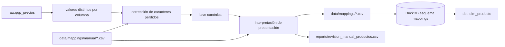

# Normalización de productos y presentaciones

Código: `src/normalize/` · Ejecución: `python -m src.cli normalize` · Pruebas: `tests/test_units.py`, `tests/test_text.py`

## Principios

1. **No se inventan equivalencias.** Si una presentación es ambigua, se conserva la mejor lectura con
   `requiere_revision = true` y queda fuera de las comparaciones (`es_comparable = false`) hasta que una persona
   la confirme.
2. **Lo automático y lo manual están separados.** Los mapeos generados se sobrescriben en cada ejecución; las
   decisiones humanas viven en `data/mappings/manual/` y siempre ganan.
3. **Se trabaja sobre valores distintos**, no sobre filas: ~5,500 presentaciones y ~800 productos en lugar de
   33.5 millones de registros.
4. **Nada se combina por similitud textual.** Dos textos son el mismo producto solo si su llave canónica es idéntica.

## Flujo

## 1. Llave canónica

`llave(texto)` = mayúsculas + sin acentos + espacios colapsados + sin puntuación final.
Su equivalente SQL es la macro `transform/macros/llave.sql`.

| Original | Llave |
|---|---|
| `Ciudad de México` / `Ciudad de Mexico` | `CIUDAD DE MEXICO` |
| `S/m` / `S/M` | `S/M` → marca `SIN MARCA` |
| `Paquete 1 Kg.` / `PAQUETE 1 KG.` | `PAQUETE 1 KG` |

`producto_id = md5(producto_key | presentacion_key | marca_key)`: las variantes de mayúsculas y acentos de un mismo
producto (p. ej. el cambio de mayo 2026) quedan en un solo producto.

## 2. Caracteres perdidos (`?`)

En `05-2026_Q2.csv` PROFECO publicó `?` en lugar de letras acentuadas (`Papeler?as`); en 2026-06 el problema se
extendió a un tercio de las filas y al municipio (`Coyoac?n`). Se corrigen `producto`, `presentacion`, `marca`,
`giro`, `cadena_comercial`, `nombre_comercial`, `direccion`, `estado` y `municipio` (D-038). Para cada valor con `?`
se buscan valores intactos de la **misma columna** que coincidan carácter por carácter, con un carácter **no ASCII**
en cada posición de `?`:

- Un único candidato (o variantes que solo difieren en mayúsculas) → corrección automática (`auto_candidato_unico`).
- Cero o varios candidatos → sin corrección, a la cola de revisión (`sin_candidato_unico`).

Exigir un carácter no ASCII evita corregir `Pe?a` hacia `Pera`. Algunas presentaciones tienen `?` legítimos
(`néctar de Miel?`); al no tener candidato, se conservan.

Las variantes que no son de acentos ni de `?` (por ejemplo `Central de Abastos` / `Central de Abasto`) se corrigen
con filas en `data/mappings/manual/texto_correcciones_manual.csv`; esas filas se agregan aunque el valor no tenga `?`
(D-028).

## 3. Interpretación de presentaciones

`src/normalize/units.py::interpretar` devuelve unidad base (`kg`, `l`, `pieza`), contenido en esa unidad, regla
aplicada, confianza y, si aplica, motivo de revisión. Reglas en orden de evaluación:

| Regla | Ejemplo | Resultado | Confianza |
|---|---|---|---|
| `cantidades_alternativas` | `Paquete 800 Ó 880 Gr.`, `40 o 44 Piezas` | revisión | baja |
| `empaque_multiple` | `Paquete con 12 Latas de 355 Ml.` | 4.26 l | media (alta si coincide con un total explícito) |
| `pieza_con_rango_de_peso` | `Concha. Pieza de 68 a 90 Gr.` | 1 pieza | media |
| `cantidad_explicita` | `Bolsa 900 Gr. Super Extra`, `LECHE ENT. 1000 ML` | 0.9 kg, 1 l | alta |
| `cantidad_explicita_con_desglose` | `Caja 85 Gr. (35 Gr. Flan y 50 Gr. Caramelo)` | 0.085 kg | alta |
| `precio_por_kg_contenido_variable` | `Paquete Contenido Variable. Kg. Seco` | 1 kg | media |
| `conteo_con_diagonal` | `Paquete C/18 Blanco` | 18 piezas | alta |
| `conteo_explicito` | `Paquete 4 Rollos. 200 Hojas Dobles` | 4 piezas (rollo) | alta |
| `conteo_con_palabra_con` | `Paquete con 2. Venus` | 2 piezas | media |
| `conteo_implicito` | `Pieza`, `Manojo. Cambray` | 1 pieza / manojo | media |
| `sin_cantidad` | `Caja`, `Bolsa. Cambray` | revisión | baja |

Motivos de revisión: `cantidades_alternativas`, `dimensiones_mixtas` (gramos y mililitros a la vez),
`multiples_cantidades` (dos cantidades distintas sin desglose), `separador_ambiguo` (`3.564 Gr.` = 3,564 g, pero
`3.785 Lt.` = 3.785 l), `empaque_inconsistente_con_total`, `conteo_por_unidad_de_empaque` (`10 Cajas. 50 Piezas C/u`),
`sin_cantidad`, `contenido_no_positivo`.

Los ejemplos del contrato quedan comparables y están cubiertos por pruebas:
`LECHE ENTERA 1 L`, `LECHE ENT. 1000 ML` y `LECHE ENTERA 1LT` → 1.0 l.

## 4. Archivos

| Archivo | Tipo | Contenido |
|---|---|---|
| `data/mappings/texto_correcciones.csv` | automático | columna, valor original, corregido, candidatos, método |
| `data/mappings/productos.csv` | automático | producto original → corregido → llave |
| `data/mappings/marcas.csv` | automático | marca original → corregida → llave, `es_sin_marca` |
| `data/mappings/presentaciones.csv` | automático + manual aplicado | interpretación completa y `metodo` (`auto`, `manual_confirmado`, `manual_corregido`, `manual_excluido`) |
| `data/mappings/manual/texto_correcciones_manual.csv` | **manual** | columna, valor_original, valor_corregido, decidido_por, fecha, justificacion |
| `data/mappings/manual/presentaciones_manual.csv` | **manual** | presentacion_key, decision (`confirmar`/`corregir`/`excluir`), unidad_base, contenido_base, subtipo_conteo, decidido_por, fecha, justificacion |
| `reports/revision_manual_productos.csv` | cola | casos pendientes priorizados por alcance (catálogos de canasta) y número de filas afectadas |
| `data/mappings/canasta_candidatos_v0.csv` | referencia Fase 0 | productos genéricos candidatos |
| `transform/seeds/canasta_articulos.csv` | **versionado** | reglas de pertenencia de productos a artículos de la canasta |

La muestra escribe sus mapeos en `data/processed/muestra/` para no sobrescribir los versionados.

## 5. Cómo resolver un caso de la cola

1. Abrir `reports/revision_manual_productos.csv` y tomar el caso de mayor prioridad.
2. Agregar una fila a `data/mappings/manual/presentaciones_manual.csv` (o `texto_correcciones_manual.csv`) con
   la decisión, quién la tomó, la fecha y la justificación.
3. Ejecutar `python -m src.cli normalize` y `python -m src.cli dbt-run`. El caso sale de la cola y la presentación
   pasa a `es_comparable = true` (salvo `excluir`).

## 6. Artículos de la canasta (v0)

Un producto normalizado pertenece a un artículo si coinciden `producto_key` y unidad base, su `presentacion_key`
cumple `incluye_regex` y no cumple `excluye_regex`. La prueba de unicidad de `dim_producto` falla si un producto
coincide con dos artículos. El valor de un artículo en una celda es la **mediana del precio unitario** de sus
productos comparables (cualquier marca); el costo es mediana × `cantidad_referencia`.
